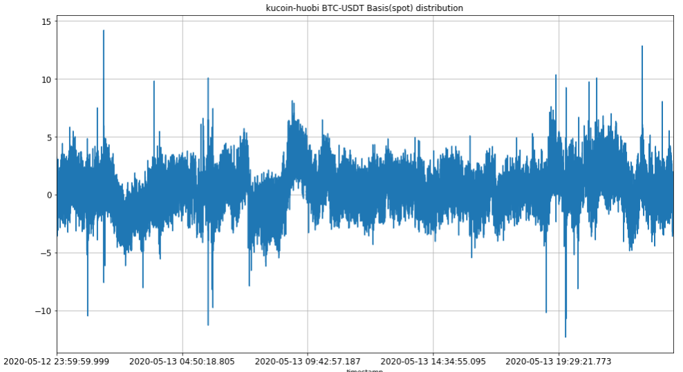

# Inter_exchange_spread

## Strategy description

The inter exchange spread strategy is commonly known as "arbitrage".

**When there is a price difference between the two exchanges for the same target, buy from Exchange A and sell on Exchange B to earn the price spread**

**The natural way to spin the story** is to say that SKII(BTC) in Korea(KuCoin Exchange) is 1000 yuan, while domestic price(Huobi Exchange) is 1,800 yuan, and my freight cost(transaction fee) is 200 yuan. Then, I bought 10 SKII in Korea and sold them all in China. Excluding the cost, I can earn a total price spread (1800-1000) * 10-200 = 7800 yuan.

In other words, **when the price spread can cover the transaction cost,** you definitely make money **without considering other special circumstances**.

But the actual situation is definitely not so ideal, so you have to know the **special cases**:

* You cannot seize all opportunities, the price changes in real time, and the profit may disappear in milliseconds;
* Although it is a risk-free arbitrage, the unilateral transaction will result in a loss;
* Exchange Api is prone to access delays and errors in the big market move.

What is the importance of the strategy?

* **Price spread**, the price difference of the designated trading target on different exchanges;
* **Trading fee**, maker/taker trading fees, and futures also include additional capital rates.

Therefore, you need to ensure that when you are "arbitrage", the price spread of the selected transaction target can cover your transaction cost, and then you can maintain profitability.

The picture above is the weekly BTC-USDT price spread chart of KuCoin Exchange and Huobi Exchange. You can see that there are many places where the price spread is large, and the spread is basically about 5 USDT.

If you can also get a certain discount on the trading fee, then you can say that your "after sleep" income must be considerable.

**KuCoin** provides **the transaction data of level 3, great matching engine, and the commission discount specially offers to the API customers**. At the same time, we offer the **sandbox environment** as the data testing support to avoid the risks.

Only a simple and incomplete trading strategy is provided here, so please pay attention to **avoiding risks** when using it. We hope that you can **make test adjustments in the sandbox environment with other parameters or strategies,  as we do not want you to become a philanthropist! ! !**

Surely, if you encounter any problems in this process, or you have a profitable strategy to share, please reflect in **ISSUE**, we will try to respond in a timely manner. 

:point_right: If you are interested in this strategy, please click **the star in the upper right corner**, we will  measure **the popularity of this strategy and subsequent optimization prioritie**s based on the amounts of stars. You can also click **watching in the upper right corner** to continue to follow this project by receiving update notifications. 

